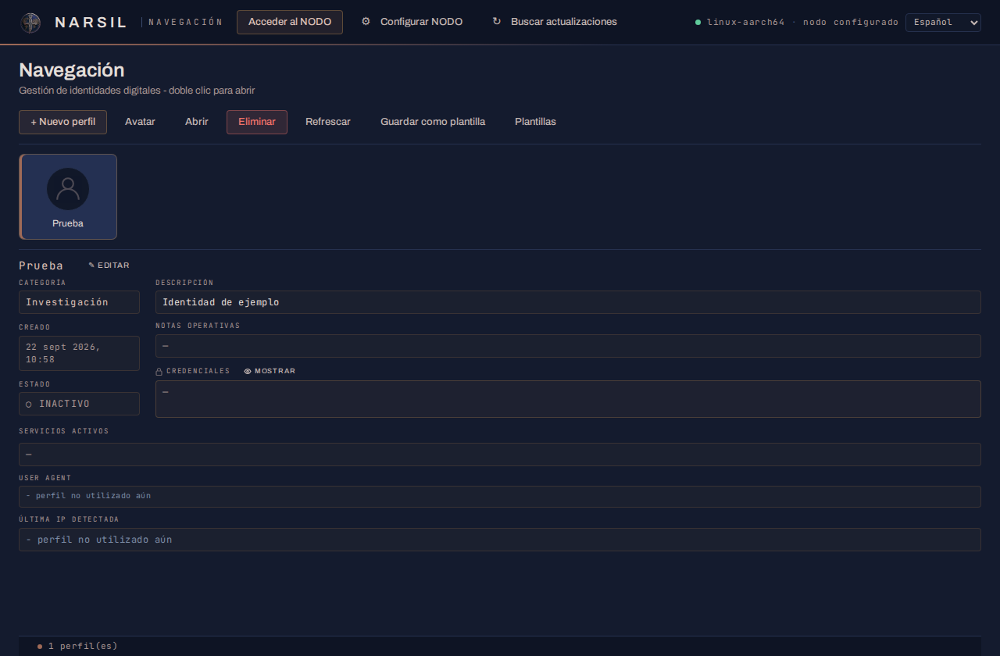
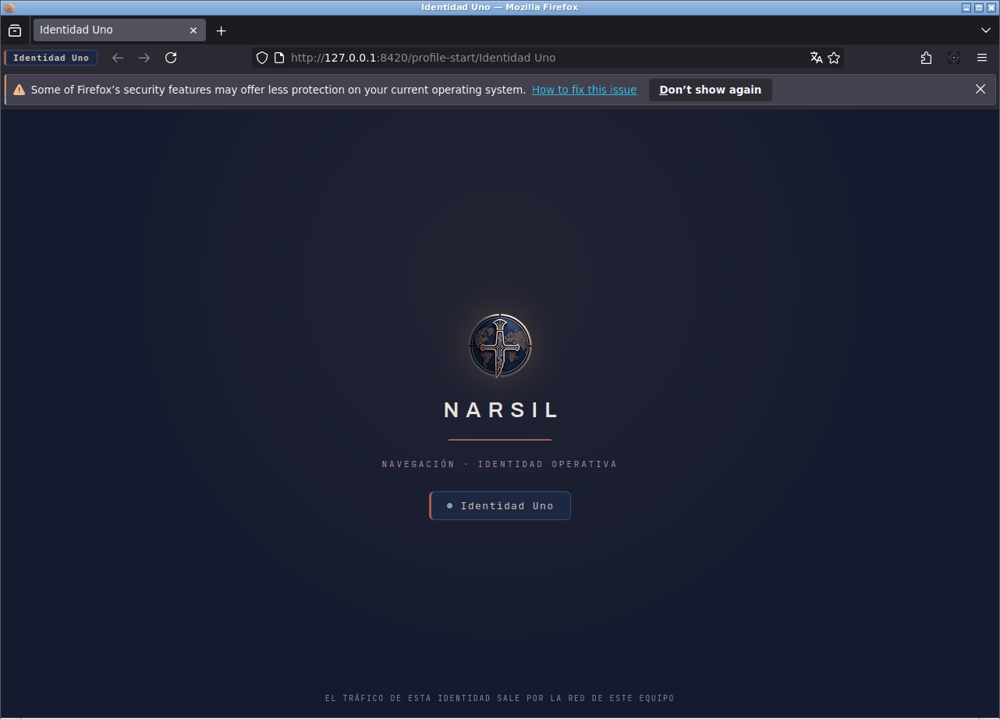
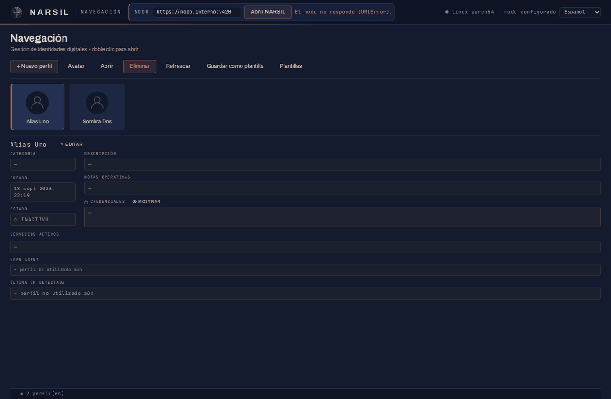
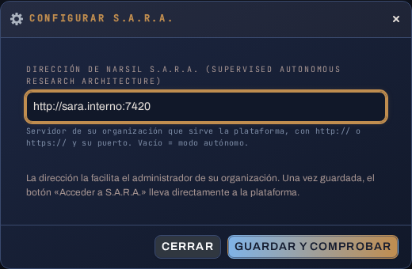
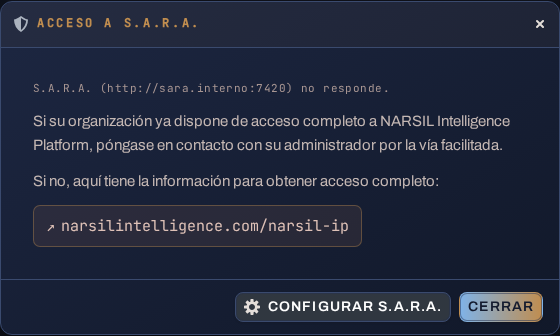

<p align="center">
  
</p>

<h1 align="center">NARSIL Navegación</h1>

<p align="center">
  Identidades de navegación aisladas para OSINT, SOCMINT y Virtual HUMINT.<br>
  Parte de <strong>NARSIL Intelligence Platform</strong>.
</p>

<p align="center">
  
  
  
  
</p>

> **Un desarrollo propio de NARSIL Intelligence.** NARSIL Navegación es el Módulo de navegación
> de *NARSIL Intelligence Platform*, la plataforma de investigación en fuentes abiertas que
> desarrollamos íntegramente en NARSIL Intelligence: las identidades de navegación (este
> programa), **S.A.R.A.**, el arnés de investigación supervisada con expedientes, cartografía y
> monitorización, y **NARSIL Brain**, la inteligencia que trabaja dentro. Este módulo se ofrece
> completo y sin coste a cualquier investigador u organización; el resto de la plataforma se
> presenta en [narsilintelligence.com/narsil-ip](https://narsilintelligence.com/narsil-ip).

<p align="center">
  <a href="https://github.com/narsilintelligence/narsil-navegacion/releases/latest"><strong>⬇ Descargar la última versión</strong></a>
  &nbsp;·&nbsp; <a href="#instalación">Instalación</a>
  &nbsp;·&nbsp; <a href="#actualizaciones">Actualizaciones</a>
  &nbsp;·&nbsp; <a href="docs/SEGURIDAD.md">Seguridad</a>
  &nbsp;·&nbsp; <a href="https://narsilintelligence.com">narsilintelligence.com</a>
</p>

<p align="center">
  
</p>

---

## Qué es

Un investigador que trabaja en redes sociales y fuentes abiertas necesita **varias
identidades de navegación** que no se mezclen entre sí ni con su vida personal: cada una con
su navegador, sus cookies, su historial y su aspecto, y todas saliendo por la red del propio
equipo (su VPN, su IP), no por un servidor común que las correlacione.

NARSIL Navegación es un programa de escritorio que hace exactamente eso. Sirve para las tres
disciplinas que se apoyan en el navegador:

- **OSINT.** Consultar fuentes abiertas sin dejar un rastro que se pueda atribuir al
  investigador ni a su organización: cada consulta sale de una identidad limpia, con su propia
  huella y su propia salida a la red.
- **SOCMINT.** Trabajar dentro de las redes sociales con cuentas de investigación que
  necesitan continuidad (cookies, sesión, historial) pero **higiene** entre casos: lo que se
  hace con una identidad no contamina a las demás, y una cuenta quemada no arrastra al resto.
- **Virtual HUMINT.** Sostener una identidad ficticia en el tiempo exige que sea siempre la
  misma: mismo navegador, misma configuración, mismo aspecto ante los servicios, y una ficha
  donde vive su leyenda —biografía, servicios en los que está dada de alta, credenciales—
  para que quien la opere no se salga del personaje.

### Lo que hace el módulo

- **Un navegador por identidad.** Cada identidad es un perfil independiente de Firefox ESR:
  cookies, historial, extensiones y ajustes propios, y su nombre en la barra del navegador
  para que nunca se confunda con otra. Es la **segmentación** que garantiza la asepsia de una
  investigación: dos identidades abiertas a la vez no comparten nada.
- **Gestión y organización de perfiles.** Cada identidad lleva su **categoría** (el caso, la
  investigación o la tipología a la que pertenece), su descripción, sus notas operativas y su
  avatar, de modo que cuarenta identidades siguen siendo cuarenta cosas distintas y no una
  lista de nombres.
- **Almacén de la identidad digital.** La ficha de cada identidad guarda los **servicios en
  los que está registrada**, su biografía o leyenda y sus **credenciales** (con un gestor de
  contraseñas integrado en la ficha, oculto por defecto), para que el operador tenga a mano
  todo lo que define a esa identidad sin salir de la app.
- **Salida a la red separable por identidad.** Cada navegador puede llevar su propia extensión
  VPN o proxy y su propio *user agent* (véase la extensión, más abajo): dos identidades pueden
  salir por países distintos y presentarse como dispositivos distintos.
- **Plantillas.** Una identidad configurada (extensiones, ajustes, aspecto) se guarda como
  plantilla y sirve de molde para las siguientes: la organización decide una vez cómo se
  monta una identidad y la app lo repite.
- **Sin telemetría, sin nube.** La app no llama a ningún servidor por su cuenta. Solo sale a la
  red cuando usted lo pide: para descargar Firefox ESR de Mozilla la primera vez, y para
  buscar una versión nueva en este repositorio si pulsa el botón.
- **Puerta a la plataforma.** El botón **Acceder a S.A.R.A.** abre el resto de NARSIL Intelligence
  Platform (expedientes, cartografía, monitorización, agentes) en el servidor de su organización.

### La extensión NARSIL Intelligence Collector

Va instalada en cada identidad y es la que convierte el navegador en herramienta de
recolección. Se abre desde su icono en la barra o con `Ctrl+Mayús+Y`; el panel de extracción
del servicio activo, con `Ctrl+Mayús+Espacio`.

- **Extracción en un clic** en los servicios para los que tiene módulo: **TikTok, Instagram,
  Facebook, X (Twitter), LinkedIn, YouTube, WhatsApp Web, Telegram Web, Discord y Element /
  Matrix.** Según el servicio: informe del perfil o de la publicación (TXT), extracción de
  conexiones, amigos, seguidores o miembros de un grupo, canal o servidor (XLSX), y datos de
  la publicación en curso. Todo se descarga al equipo del operador; nada pasa por un servidor.
- **User agent operativo.** Desde el panel se cambia la identidad del navegador ante los
  servicios —Chrome, Opera o Safari de escritorio; Chrome, Firefox, Opera o Safari móviles; o
  una cadena propia— por identidad, para que cada una se presente como el dispositivo que su
  leyenda requiere.
- **Grabación de la sesión de navegación** *(próxima versión)*: la extensión ya captura la
  pestaña fotograma a fotograma; el almacén de evidencias con sello de tiempo llega en la
  siguiente entrega y se activará solo con una actualización.

<p align="center">
  
</p>

## Instalación

Un solo fichero, sin instalador. Descargue el que corresponda a su equipo desde la
[**página de versiones**](https://github.com/narsilintelligence/narsil-navegacion/releases/latest) (o de la
carpeta `ejecutables/` si recibió una copia). Junto a los ejecutables está `SHA256SUMS`, con la
suma de cada uno, por si quiere comprobar la descarga:

| Su equipo | Fichero |
|---|---|
| Windows 10/11 de 64 bits *(lo habitual)* | `NARSIL Navegacion-windows-x86_64.exe` |
| Windows en ARM (Surface, Snapdragon) | `NARSIL Navegacion-windows-arm64.exe` |
| Linux de 64 bits (Ubuntu, Debian, Fedora…) | `narsil-navegacion-linux-x86_64` |
| Linux en ARM64 | `narsil-navegacion-linux-aarch64` |

> ¿No sabe cuál? En Windows: *Configuración → Sistema → Acerca de → Tipo de sistema*. En Linux:
> `uname -m` (`x86_64` o `aarch64`).

**Windows.** Copie el `.exe` a una carpeta suya (por ejemplo `Documentos\NARSIL`) y haga doble
clic. Al lado se creará `data\`, con todo lo que es suyo. Windows puede avisar de que el
programa no está firmado: *Más información → Ejecutar de todas formas*.

**Linux.** Dé permiso de ejecución y arranque:

```bash
chmod +x narsil-navegacion-linux-x86_64
./narsil-navegacion-linux-x86_64
```

Para la ventana propia hace falta WebKitGTK (en Debian/Ubuntu: `sudo apt install python3-gi
gir1.2-gtk-3.0 gir1.2-webkit2-4.1`); sin él, la interfaz se abre en su navegador habitual.
`bash empaquetado/instalar-linux.sh` la deja en el menú de aplicaciones con su icono.

### Primer arranque

1. Se abre la ventana de NARSIL Navegación.
2. Si no hay Firefox ESR en el equipo, pulse **Instalar Firefox ESR**: la app lo descarga de
   Mozilla (~70 MB) y lo deja dentro de su carpeta `data\`, sin tocar el Firefox que pueda
   tener instalado.
3. **+ Nuevo perfil** → un nombre → **Crear**. Selecciónelo y pulse **Abrir**: Firefox arranca
   con esa identidad.

> **Tiene que ser Firefox ESR**, no la versión normal. La versión normal acepta el perfil pero
> deja fuera la extensión Collector, y lo hace sin avisar. La app comprueba el canal y se lo
> dice si el navegador no sirve.

<p align="center">
  
</p>

## Acceder a NARSIL Intelligence Platform

NARSIL Intelligence Platform se compone de tres sistemas:

| Sistema | Qué es |
|---|---|
| **NARSIL Navegación** | Este programa: las identidades de navegación, en el equipo de cada operador. Gratuito. |
| **NARSIL S.A.R.A.** | *Supervised Autonomous Research Architecture*: el arnés y el resto de capas —expedientes, cartografía, monitorización, agentes— que su organización instala en su propio servidor. |
| **NARSIL Brain** | La inteligencia que trabaja dentro de S.A.R.A. |

El Módulo de navegación funciona solo. Para el resto hace falta que su organización disponga de
**acceso completo** a la plataforma y tenga S.A.R.A. instalada.

- **⚙ Configurar S.A.R.A.**: escriba la dirección que le facilite su administrador
  (`https://servidor:puerto`) y pulse *Guardar y comprobar*. Se hace una vez.
- **Acceder a S.A.R.A.**: abre la plataforma en otra ventana de la app.

Si no hay ninguna S.A.R.A. configurada, o la configurada no responde, el acceso muestra un
aviso: si su organización ya dispone de acceso completo, contacte con su administrador; si no,
el enlace le lleva a la información para obtenerlo ([narsilintelligence.com/narsil-ip](https://narsilintelligence.com/narsil-ip)).

<p align="center">
  
  
</p>

## Actualizaciones

En la cabecera, **Buscar actualizaciones** consulta las versiones publicadas en la página de
*Releases* de este repositorio. La app **solo pregunta cuando usted pulsa el botón**; nunca por su
cuenta. Si hay una versión nueva se la muestra con sus notas y, si acepta, descarga el
ejecutable de su equipo, comprueba su suma SHA-256 contra la publicada y, únicamente si
coincide, lo instala. Después, un botón cierra la aplicación; ábrala de nuevo desde su acceso
directo y ya será la versión nueva. Nada de lo suyo se toca: identidades, credenciales,
avatares, descripciones y la dirección de S.A.R.A. viven en `data\`, fuera del ejecutable. Si la
suma no coincide, no se instala nada y se lo dice.

## Dónde están sus datos

Junto al ejecutable, en `data\`:

```
data/
├── runtime/base_browser/   Firefox ESR descargado por la app
├── profiles/               sus identidades (una carpeta por identidad)
├── settings/app.json       la dirección de S.A.R.A.
└── logs/app.log            registro de la app
```

Llévese la carpeta entera (ejecutable + `data\`) a otro equipo y todo sigue ahí. Si la carpeta
del ejecutable no se puede escribir, `data\` va a `%LOCALAPPDATA%\NARSIL Navegacion` (Windows)
o `~/.local/share/NARSIL Navegacion` (Linux).

## Privacidad y seguridad

- La app escucha **sólo en su equipo** (`127.0.0.1`) y lleva un guardia contra las páginas que
  una identidad pueda abrir y que intenten hablar con ella.
- Ninguna identidad pide nada a terceros por culpa de la app: ni tipografías, ni iconos, ni
  scripts. Cada identidad sale por la red de su equipo.
- **Sus identidades están tan protegidas como su disco.** La app no les pone contraseña: un PIN
  no protegería carpetas que cualquiera puede copiar. Cifre el disco (BitLocker, LUKS) y bloquee
  la sesión; eso sí las protege.
- Sin telemetría ni comprobaciones de versión. Detalle en [`docs/SEGURIDAD.md`](docs/SEGURIDAD.md).

## Problemas frecuentes

| Qué ve | Qué pasa |
|---|---|
| «El navegador que hay no sirve» | Tiene un Firefox normal, no ESR. Pulse *Instalar Firefox ESR*: la app instala el suyo sin tocar el otro. |
| La app se abre en el navegador en vez de en su ventana | Falta el motor de ventana (WebView2 en Windows, WebKitGTK en Linux). Funciona igual; la ventana propia vuelve al instalarlo. |
| El aviso de acceso sale aunque S.A.R.A. esté configurada | S.A.R.A. no responde desde este equipo. *Configurar S.A.R.A. → Guardar y comprobar* dice por qué. |
| Windows bloquea el `.exe` | No está firmado. *Más información → Ejecutar de todas formas*. |
| Algo no funciona | Mire `data\logs\app.log` junto al ejecutable. |

## Construir desde el código

El repositorio contiene todo el código. Cada ejecutable se construye en su propia plataforma
con `empaquetado/construir.ps1` (Windows) o `empaquetado/construir.sh` (Linux); las
instrucciones completas están en [`docs/CONSTRUIR.md`](docs/CONSTRUIR.md).

```
backend/      servidor local (Python · FastAPI), gestión de perfiles, lanzador y ventana
ui/           interfaz (React · Vite), compilada dentro del ejecutable
empaquetado/  scripts de construcción e instalación, icono
docs/         construcción, seguridad, imágenes
```

## Licencia

NARSIL Navegación es **gratuita** y de **uso libre** para cualquier persona u organización, en
cuantos equipos necesite. No está permitido modificarla, redistribuirla fuera de los canales
oficiales, comercializarla ni construir productos con ella. El texto completo está en
[`LICENSE`](LICENSE).

Firefox ESR se descarga de Mozilla y conserva su licencia (MPL 2.0). El resto de componentes
de terceros conservan las suyas.

<p align="center">
  <sub>© 2026 NARSIL Intelligence · NARSIL Navegación forma parte de NARSIL Intelligence Platform ·
  <a href="https://narsilintelligence.com">narsilintelligence.com</a></sub>
</p>
